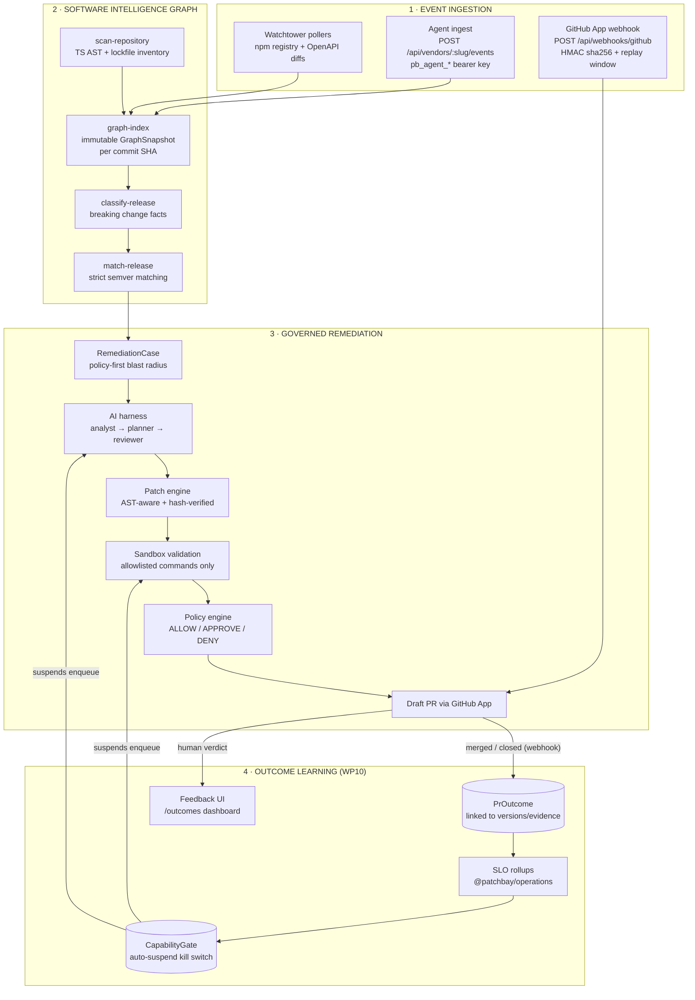
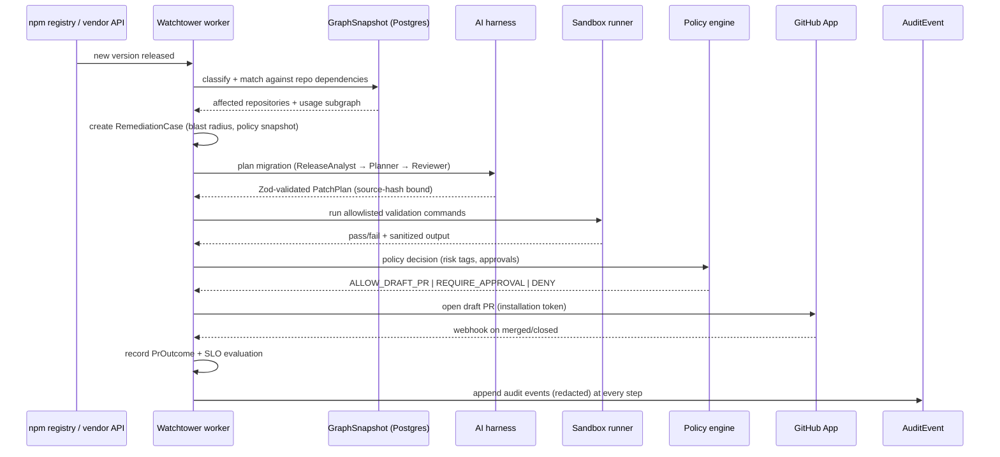
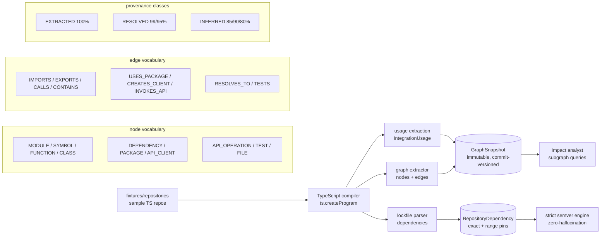
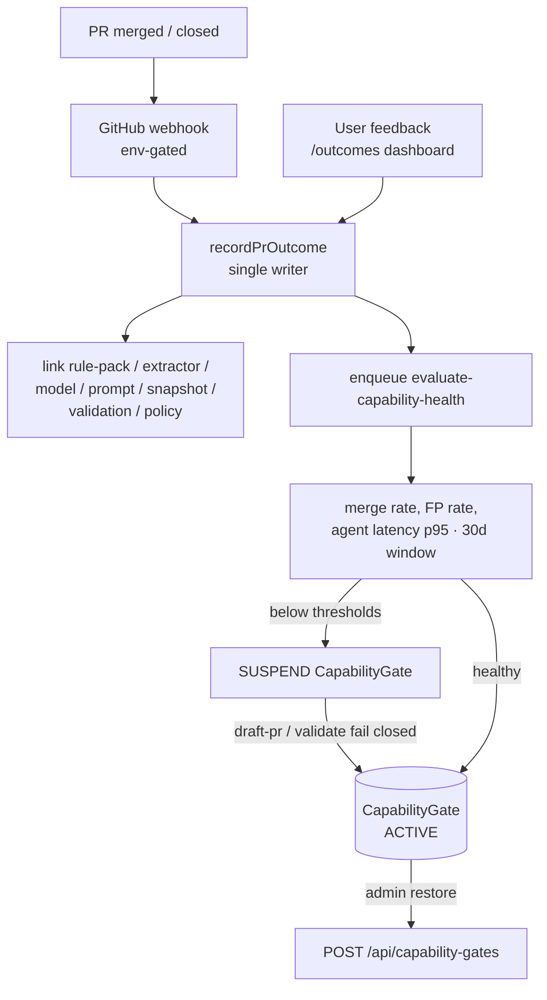

# Patchbay — Governed API-Change Remediation Platform

[](https://github.com/Rehan147ig/patchbay/actions)
[](https://opensource.org/licenses/MIT)
[](https://www.typescriptlang.org/)
[](https://pnpm.io/)
[](https://www.prisma.io/)

**Patchbay** is a neutral, policy-governed API-change remediation platform. When a vendor releases a
breaking SDK update, deprecates a method, or updates an API specification, Patchbay detects the release
via its Release Watchtower, proves TypeScript AST usages across your repositories using a commit-versioned
**Software Intelligence Graph**, and opens reviewable draft pull requests when a certified rule pack exists
(OpenAI, Stripe, Twilio for Node/TS today; Auth0 and Generic OpenAPI for reviewable planning; 56-connector
catalog for detection and impact assessment).

Patchbay validates all code edits in an isolated sandbox runner, enforces policy-based approval gates
(payments, auth, webhooks), opens governed draft PRs that are never auto-merged, and immutably audits
every decision — with an outcome-learning capability kill switch driving reliability.

> **For AI coding agents**: start at [`AGENTS.md`](AGENTS.md) — it is the canonical orientation
> document (repo layout, non-negotiable rules, verification commands, architecture rules).

---

## 🏗️ System Architecture



### End-to-end remediation flow (one breaking release)



### AST extraction & Software Intelligence Graph



### Outcome learning loop (WP10)



---

## ✨ Key Features

- **Software Intelligence Graph (`packages/repo-analysis`)**:
  - Immutable, content-addressed `GraphSnapshot` per commit SHA.
  - Granular node vocabulary (`MODULE`, `SYMBOL`, `FUNCTION`, `DEPENDENCY`, `API_CLIENT`, `API_OPERATION`, `TEST`) and strict edge vocabulary (`USES_PACKAGE`, `CREATES_CLIENT`, `INVOKES_API`, `EXPORTS`, `IMPORTS`, `TESTS`).
  - Fixed provenance (`EXTRACTED`, `RESOLVED`, `INFERRED`) with file path, line range, and source hash evidence.
  - TypeScript via the compiler API (strongest L3 path) plus Python L1 via `web-tree-sitter` (WASM).

- **Deterministic Semver & Matching Engine (`packages/domain`, `apps/worker`)**:
  - Zero-hallucination semver parser (`parseVersion`, `compareVersions`, `satisfiesRange`).
  - `classify-release` and `match-release` jobs linking global releases to repository dependencies with zero false positives.

- **56-Connector Catalog & Declarative SDK (`packages/vendor-connectors`)**:
  - Pre-built connectors across 10 categories (AI/LLM, Cloud/Infra, Payments, Auth, Messaging, DB/Data, Web Frameworks, Search/Observability, CRM, Generic OpenAPI).
  - Declarative `defineConnector()` SDK — a new vendor connector in ~40 lines of TypeScript.
  - Connector **certification registry** (`getCapability`, `requireCertified`) gating PLAN/VALIDATE/DRAFT_PR capability levels (WP9).

- **AI Harness (`packages/ai-harness`, `packages/ai-provider`)**:
  - Provider registry (`mock` default, `openai`, custom) behind `AiProvider`.
  - Deterministic workflow supervisor: Release Analyst → Impact Analyst → Migration Planner → Independent Reviewer, with `AgentRun`/`AgentStep` persistence (tokens, latency, cost), replay from failures, and a Mastra-contract adapter as the swap point.
  - Planner/reviewer performance measurement (`measureWorkflow`) with PASS/FAIL thresholds.

- **Governed Remediation Pipeline (`apps/worker`, engine packages)**:
  - `RemediationCase` lifecycle (`OBSERVED → … → MERGED/CLOSED`) with append-only `RemediationCaseEvent` timeline.
  - AST-aware patch generation with source-hash verification and diff budgets (`packages/remediation-engine`).
  - Allowlisted sandbox validation (`packages/sandbox-runner`) — LLMs have zero shell access.
  - Declarative policy gates for payment/auth/PII/webhook/infrastructure changes (`packages/policy-engine`).

- **GitHub App & Real Repository Integration (`packages/git-provider`)**:
  - JWT minting + installation access tokens, atomic draft PR creation.
  - HMAC `sha256` webhook receiver with delivery deduplication, replay window, and monotonic `DRAFT → OPEN → MERGED/CLOSED` PR status sync.

- **Outcome Learning & Enterprise Operations (WP10)**:
  - `PrOutcome` records every terminal PR with full version/evidence/policy linkage; merged outcomes terminalize their case.
  - `/outcomes` dashboard: SLO cards (merge rate, false positive rate, detection latency p95, validation pass rate, agent failure rate, cost per successful remediation) + one-click human feedback classification.
  - Capability kill switch: worker auto-suspends a vendor's `DRAFT_PR` gate when SLOs degrade; `draft-pr`/`validate` routes fail closed while suspended; admin restore via Settings.
  - Enterprise controls: admin export (no raw agent inputs/outputs), org data deletion with an immutable `data.deleted` audit marker, and 90-day agent-run retention purge (audited).

- **Multi-Tenant Security & Governance**:
  - Direct `organizationId` foreign keys + indexes across all operational models; `withOrgContext` row-scoping helpers.
  - Append-only `AuditEvent` trail with automatic secret redaction; correlation IDs on every request.

---

## 📁 Monorepo Structure

```
patchbay/
├── apps/
│   ├── web/                     # Next.js 15 App Router dashboard & typed JSON API route handlers
│   └── worker/                  # BullMQ background worker (scan, analyze, graph-index, validate, create-pr, evaluate-capability-health, purge-agent-runs)
├── packages/
│   ├── ai-harness/              # AI workflow supervisor (analyst → planner → reviewer) + measurement
│   ├── ai-provider/             # AiProvider interface (Mock & OpenAI-compatible drivers)
│   ├── audit/                   # Append-only AuditEvent builder & secret redaction
│   ├── billing/                 # Stripe subscription plans/caps (SDK-free REST client)
│   ├── db/                      # Prisma schema, client singleton, org row-scoping, seed
│   ├── domain/                  # Single source of truth: enums, semver, Zod schemas, errors, logger
│   ├── env/                     # Typed environment variable validation & secret management
│   ├── git-provider/            # GitProvider abstraction (Local, GitHub PAT, GitHub App)
│   ├── operations/              # WP10: SLO rollups, capability health, retention purge (DB-free)
│   ├── policy-engine/           # Deterministic policy decisions (ALLOW/APPROVE/DENY)
│   ├── queue/                   # BullMQ queue definitions, job contracts, Redis connection
│   ├── remediation-engine/      # AST-aware transformation rules & unified diff generation
│   ├── repo-analysis/           # TS compiler API AST indexer + Python L1 + graph extractor
│   ├── sandbox-runner/          # Allowlisted command execution with timeouts & output bounds
│   ├── ui/                      # Accessible UI primitives (Card, Button, Badge, Table, CodeBlock)
│   └── vendor-connectors/       # 56-connector catalog, certification registry, defineConnector SDK
├── docs/                        # architecture.md, CTO execution plan, agent-harness roadmap, ledger, threat model
├── fixtures/repositories/       # Legacy sample repositories for analysis/testing
└── e2e/                         # Playwright specs (apps/web/e2e)
```

---

## ⚡ Quick Start & Development Setup

### Prerequisites

- **Node.js**: `>= 22.0.0`
- **pnpm**: `>= 10.0.0`
- **Docker**: Docker Desktop or Docker Engine (with Compose)

### 1. Clone & Install

```bash
git clone https://github.com/Rehan147ig/patchbay.git
cd patchbay
pnpm install
```

### 2. Configure Environment & Start Services

```bash
cp .env.example .env          # Default local values work out of the box
docker compose up -d          # Starts PostgreSQL (port 5434) and Redis (port 6380)
```

### 3. Initialize Database & Seed Demo Data

```bash
pnpm db:generate              # Generate Prisma Client
pnpm db:migrate               # Apply committed database migrations
pnpm db:seed                  # Seed Acme SaaS organization & vendor catalog
```

### 4. Launch Development Environment

```bash
pnpm dev                      # Starts Next.js web app (http://localhost:3000) & BullMQ worker
```

> Playwright (`pnpm e2e`) starts its own web server on port 3000 — stop any other process
> listening on 3000 first, and keep the worker running for job-processing flows.

---

## 🧪 Verification & Testing

The repository enforces clean quality gates across all 18 workspace projects (2 apps + 16 packages):

```bash
# Typecheck all 18 projects (zero errors)
pnpm typecheck

# Run full Vitest suite (925 passing tests across 86 test files)
pnpm test

# ESLint, zero warnings
pnpm lint

# Prettier check
pnpm format:check

# Production build
pnpm build

# Playwright end-to-end (demo happy path + outcomes dashboard)
pnpm e2e
```

> **Note on `[id]` route tests:** Vitest treats `[id]` in paths as a glob character class, so
> route tests under `apps/web/src/app/api/**/[id]/**` are excluded from `pnpm test`. Run them with
> the temp config: `pnpm vitest run --config vitest.wp10.config.ts` (aliases `@` and `server-only`).

---

## 🧭 Guided Tour for External Agents

- **Orientation**: [`AGENTS.md`](AGENTS.md) — repo layout, non-negotiable engineering rules, commands, architecture rules.
- **Architecture**: [`docs/architecture.md`](docs/architecture.md) — package boundaries, subsystems, security boundaries.
- **Product/execution**: [`docs/PATCHBAY-CTO-EXECUTION-PLAN.md`](docs/PATCHBAY-CTO-EXECUTION-PLAN.md) — work-package statuses (WP1–WP10).
- **AI harness**: [`docs/PATCHBAY-AGENT-HARNESS-ROADMAP.md`](docs/PATCHBAY-AGENT-HARNESS-ROADMAP.md) and `docs/PATCHBAY-AGENT-HARNESS-IMPLEMENTATION-REPORT.md`.
- **Watchtower**: [`docs/RELEASE-WATCHTOWER.md`](docs/RELEASE-WATCHTOWER.md) — release ledger, adapters, queue topology.
- **Development history**: [`docs/development-ledger.md`](docs/development-ledger.md) — what shipped per work package, with test counts.
- **Threat model**: [`docs/threat-model.md`](docs/threat-model.md) — security boundaries and assumptions.

---

## 🔐 Security & Governance Principles

1. **Draft PR Default**: Patchbay opens draft pull requests only; auto-merging is never enabled.
2. **Mandatory Validation**: Validation must pass before any PR is submitted; only allowlisted commands run in the sandbox.
3. **Approval Gates**: Payment, Auth/Authorization, PII, Webhook, Encryption, Secrets, and Infrastructure changes require explicit human approval.
4. **Command Allowlist**: LLMs have zero shell access; sandbox runs strictly allowlisted build/test commands with timeouts.
5. **Secret Redaction**: Secrets are redacted from logs, audit events, and AI contexts; credentials live server-side only.
6. **Monotonic PR Sync**: GitHub webhook status updates move strictly forward (`DRAFT → OPEN → MERGED/CLOSED`).
7. **Fail-Closed Capabilities**: SLO-degraded vendor capabilities are auto-suspended and require admin restore.
8. **Local-Dev Honesty**: The bundled sandbox and dev authentication are local-development tools, not hardened multi-tenant infrastructure — stated in docs and UI.

---

## 📜 License

Distributed under the MIT License. See [`LICENSE`](LICENSE) for more information.
