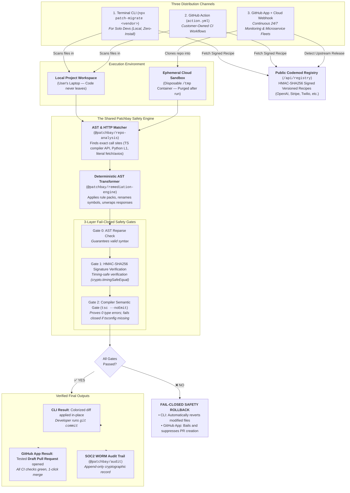

# Patchbay — Governed API-Change Remediation Platform

[](https://github.com/Rehan147ig/patchbay/actions)
[](https://opensource.org/licenses/MIT)
[](https://www.typescriptlang.org/)
[](https://pnpm.io/)
[](https://www.prisma.io/)

**Patchbay** is a neutral, policy-governed API-change remediation platform ("Dependabot for APIs"). When a vendor releases a breaking SDK update, deprecates a method, or updates an API specification, Patchbay detects the release, proves AST usages across your repositories using a commit-versioned **Software Intelligence Graph**, and delivers compile-verified, test-passing remediations across **3 zero-friction distribution channels**:

1. **Terminal CLI (`npx patch-migrate <vendor>`)**: Runs 100% locally on your machine — zero install, zero code access required.
2. **GitHub Action (`action.yml`)**: Runs inside customer-owned CI runners.
3. **Continuous GitHub App & Dashboard**: 24/7 Release Watchtower monitoring, automated Draft PR dispatch, and private internal SDK fleet governance.

> **For AI coding agents**: start at [`AGENTS.md`](AGENTS.md) — it is the canonical orientation document (repo layout, non-negotiable rules, verification commands, architecture rules).

---

## ⚡ Zero-Install CLI Quickstart

Any developer can migrate breaking SDKs locally with zero signup or repository permissions:

```bash
# Preview changes with colored terminal diff (dry-run)
npx patch-migrate openai

# Apply transforms in place with automatic `tsc --noEmit` compiler gate & rollback
npx patch-migrate openai --write

# Target a specific subdirectory or workspace
npx patch-migrate stripe --write --cwd ./apps/backend
```

---

## 🏗️ System Architecture



---

## ✨ Key Features & Components

- **Public Codemod Registry (`/api/registry`)**:
  - `GET /api/registry`: Lists all certified migration recipes (`DRAFT_PR` + `PLAN`).
  - `GET /api/registry/:vendor/:from/:to`: Returns structured `MigrationRecipe` signed with HMAC-SHA256 over canonical JSON.
  - Verified with `crypto.timingSafeEqual` in `@patchbay/cli` before any disk writes.

- **OpenAPI HTTP Client Canonicalizer (`packages/repo-analysis/src/http-matcher.ts`)**:
  - Literal-only detection of `fetch`, `axios`, `ky`, and `got` callsites (string literals & template literal tails).
  - Promoted strictly to **`PLAN` (with `REQUIRE_APPROVAL`)** to prevent false positives and preserve certification metrics.

- **Deterministic AST Remediation Engine (`packages/remediation-engine`)**:
  - Exact symbol renames, method transforms, response unwrapping, and feature adoption inserts.
  - **CRLF Line-Ending Preservation**: Detects original EOL (`\r\n` vs `\n`) and preserves file formatting.
  - **TOCTOU Guard**: Verifies expected file hashes and target symbols before applying edits, safely skipping drifted lines.
  - **Post-Rename Python Bootstrap**: Injects `from openai import OpenAI` / `client = OpenAI()` after line renames to prevent line number drift.

- **Software Intelligence Graph (`packages/repo-analysis`)**:
  - Immutable, content-addressed `GraphSnapshot` per commit SHA.
  - Granular node vocabulary (`MODULE`, `SYMBOL`, `FUNCTION`, `DEPENDENCY`, `API_CLIENT`, `API_OPERATION`, `TEST`) and strict edge vocabulary.
  - TypeScript via the compiler API (L3 path) plus Python L1 via `web-tree-sitter`.

- **56-Connector Catalog & Declarative SDK (`packages/vendor-connectors`)**:
  - Pre-built connectors across 10 categories (AI/LLM, Cloud/Infra, Payments, Auth, Messaging, DB/Data, Web Frameworks, etc.).
  - Declarative `defineConnector()` SDK.
  - Certified `DRAFT_PR` capability rule packs for OpenAI, Stripe, Twilio, Anthropic, AWS SDK, and Supabase.

- **Enterprise Governance & Security**:
  - **Zero Persistent Code Retention**: Repositories are cloned to ephemeral sandboxes (`$TMP/patchbay-*`) and wiped immediately after diff generation.
  - **Private Vendor Ingest**: Internal company platform teams register private packages (`@acme/auth`) via Argon2id-authenticated `pb_agent_*` keys.
  - **Capability Kill Switch**: Auto-suspends degraded connector gates if merge rates fall below SLO thresholds.

---

## 📁 Monorepo Structure (19 Workspace Projects)

```
patchbay/
├── apps/
│   ├── web/                     # Next.js 15 dashboard & public JSON API route handlers
│   └── worker/                  # BullMQ background worker (Watchtower, scan, analyze, validate, create-pr)
├── packages/
│   ├── ai-harness/              # AI workflow supervisor (analyst → planner → reviewer)
│   ├── ai-provider/             # AiProvider interface (Mock & OpenAI-compatible drivers)
│   ├── audit/                   # Append-only WORM AuditEvent builder & secret redaction
│   ├── billing/                 # Stripe / Dodo subscription plans & usage meters
│   ├── cli/                     # @patchbay/cli (npx patch-migrate binary)
│   ├── db/                      # Prisma schema, client singleton, org row-scoping, seed
│   ├── domain/                  # Single source of truth: enums, semver, Zod schemas, errors, logger
│   ├── env/                     # Typed environment variable validation & secret management
│   ├── git-provider/            # GitProvider abstraction (Local, GitHub PAT, GitHub App)
│   ├── operations/              # SLO rollups, capability health, retention purge
│   ├── policy-engine/           # Deterministic policy decisions (ALLOW/APPROVE/DENY)
│   ├── queue/                   # BullMQ queue definitions, job contracts, Redis connection
│   ├── remediation-engine/      # AST-aware transformation rules, CRLF preservation, diff generation
│   ├── repo-analysis/           # TS compiler AST indexer, Python L1, http-matcher, graph extractor
│   ├── sandbox-runner/          # Allowlisted command execution with timeouts & output bounds
│   ├── ui/                      # Accessible UI primitives (Card, Button, Badge, Table, PageHeader)
│   └── vendor-connectors/       # 56-connector catalog, certified registry recipes, defineConnector SDK
├── docs/                        # architecture.md, security.md, threat-model.md, execution plan
├── fixtures/repositories/       # Legacy sample repositories for analysis & verification
└── action.yml                   # Model 2 GitHub Action definition
```

---

## ⚡ Quick Start & Development Setup

### Prerequisites

- **Node.js**: `>= 22.0.0`
- **pnpm**: `>= 10.0.0`
- **Docker**: Docker Desktop or Docker Engine (with Compose)

### 1. Clone & Install

```bash
git clone https://github.com/Rehan147ig/patchbay.git
cd patchbay
pnpm install
```

### 2. Configure Environment & Start Services

```bash
cp .env.example .env          # Default local values work out of the box
docker compose up -d          # Starts PostgreSQL (port 5434) and Redis (port 6380)
```

### 3. Initialize Database & Seed Demo Data

```bash
pnpm db:generate              # Generate Prisma Client
pnpm db:migrate               # Apply database migrations
pnpm db:seed                  # Seed Acme SaaS organization & vendor catalog
```

### 4. Launch Development Environment

```bash
pnpm dev                      # Starts Next.js web app (http://localhost:3000) & BullMQ worker
```

---

## 🧪 Verification & Quality Gates

The repository enforces strict quality gates across all 19 workspace projects:

```bash
# Typecheck all 19 projects (zero errors)
pnpm typecheck

# Run full Vitest suite (1,067+ passing tests across 99 test files)
pnpm test

# Eval corpus certification gate (DRAFT_PR prerequisite)
pnpm test:corpus

# ESLint, zero warnings
pnpm lint

# Prettier format check
pnpm format:check

# Production Next.js build
pnpm build
```

---

## 🔐 Security & Governance Principles

1. **Draft PR Default**: Patchbay opens draft pull requests only; auto-merging is never enabled.
2. **Mandatory Compiler & Test Gates**: `tsc --noEmit` and tests must pass before any PR is generated; fails closed if `tsconfig.json` is missing.
3. **Timing-Safe Cryptographic Signatures**: All registry recipes are signed with HMAC-SHA256 and verified with `timingSafeEqual`.
4. **Approval Gates**: Payment, Auth/Authorization, PII, Webhook, and Infrastructure changes require explicit human approval.
5. **Zero Persistent Code Retention**: Cloned code is processed in disposable ephemeral sandboxes and purged immediately.
6. **Command Allowlist**: LLMs have zero shell access; sandbox runs strictly allowlisted commands with timeouts and secret redaction.
7. **Monotonic PR Sync**: GitHub webhook status updates move strictly forward (`DRAFT → OPEN → MERGED/CLOSED`).
8. **Fail-Closed Capabilities**: SLO-degraded vendor capabilities are auto-suspended and require admin restore.

---

## 📜 License

Distributed under the MIT License. See [`LICENSE`](LICENSE) for more information.
