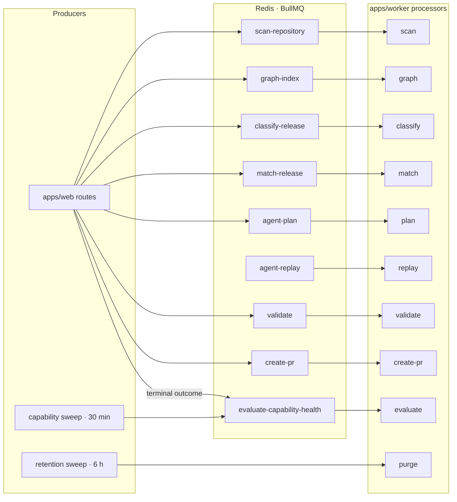
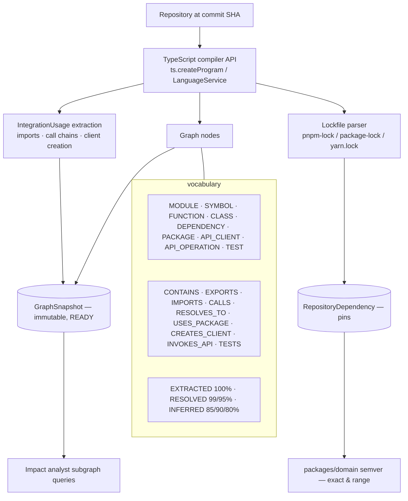
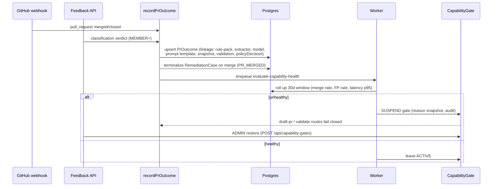

# Patchbay — System Architecture

> Canonical technical orientation for humans and coding agents. For behavioral rules and
> commands see [`AGENTS.md`](../AGENTS.md); for work-package status see
> [`PATCHBAY-CTO-EXECUTION-PLAN.md`](PATCHBAY-CTO-EXECUTION-PLAN.md).

## 1. Overview & Monorepo Structure

Patchbay is a high-assurance, policy-governed code remediation platform. It is structured as a
**pnpm monorepo** separating deployable applications (`apps/web`, `apps/worker`) from pure,
DB-free domain and engine packages (`packages/*`).

```mermaid
flowchart TB
    subgraph Apps
        WEB[apps/web — Next.js 15 App Router<br/>dashboard (RSC) + typed JSON API handlers]
        WORKER[apps/worker — BullMQ processors<br/>scan · analyze · graph-index · validate · create-pr<br/>evaluate-capability-health · purge-agent-runs]
    end

    subgraph Storage
        PG[(Postgres 5434 — Prisma)]
        REDIS[(Redis 6380 — BullMQ queues)]
    end

    subgraph Pure["DB-free pure packages"]
        DOMAIN[domain · enums/semver/Zod/errors/logger]
        AUDIT[audit · events + redaction]
        POLICY[policy-engine · ALLOW/APPROVE/DENY]
        REM[remediation-engine · AST rules + diffs]
        ANALYSIS[repo-analysis · AST index + graph]
        CONN[vendor-connectors · catalog + certs]
        AI[ai-harness + ai-provider]
        GIT[git-provider · Local/GitHub/App]
        SANDBOX[sandbox-runner · allowlist]
        OPS[operations · SLOs + kill switch + retention]
        BILL[billing · Stripe plans]
    end

    WEB <--> PG
    WEB --> REDIS
    WORKER <--> REDIS
    WORKER <--> PG
    WEB --> OPS
    WORKER --> OPS
    WORKER --> DOMAIN
    WORKER --> ANALYSIS
    WORKER --> REM
    WORKER --> POLICY
    WORKER --> CONN
    WORKER --> AI
    WORKER --> GIT
    WORKER --> SANDBOX
    WEB --> DOMAIN
    WEB --> AUDIT
    WEB --> BILL
    WEB --> CONN
```

### Package boundaries (dependency direction)

| Package                       | Responsibility                                                                                                                                                                                               | DB access                            |
| ----------------------------- | ------------------------------------------------------------------------------------------------------------------------------------------------------------------------------------------------------------ | ------------------------------------ |
| `packages/domain`             | Enums (single source of truth, drift-tested against Prisma), semver engine, Zod schemas, error classes, JSON logger                                                                                          | none                                 |
| `packages/env`                | Typed env parsing, secret redaction utilities                                                                                                                                                                | none                                 |
| `packages/db`                 | Prisma schema, client singleton, `withOrgContext` row-scoping, seed                                                                                                                                          | Postgres (only entry point)          |
| `packages/audit`              | Append-only `AuditEvent` builder, `AuditAction` registry, secret redaction                                                                                                                                   | none                                 |
| `packages/vendor-connectors`  | 56-connector catalog, OpenAPI diff normalizers, `defineConnector` SDK, **certification registry** (`getCapability`, `requireCertified`)                                                                      | none                                 |
| `packages/repo-analysis`      | TypeScript compiler-API AST indexer, Python L1 (`web-tree-sitter` WASM), **Software Intelligence Graph** extractor, lockfile parsers                                                                         | none                                 |
| `packages/remediation-engine` | Deterministic migration rules, unified diff generation, evaluation corpus runner                                                                                                                             | none                                 |
| `packages/policy-engine`      | Declarative JSON policy decisions (`ALLOW_DRAFT_PR`, `REQUIRE_APPROVAL`, `ALLOW_PLAN_ONLY`, `DENY`)                                                                                                          | none                                 |
| `packages/ai-harness`         | AI workflow supervisor (analyst → planner → reviewer), Zod `PatchPlan` validation, token/cost accounting, `measureWorkflow` benchmark, Mastra-contract adapter                                               | none                                 |
| `packages/ai-provider`        | `AiProvider` interface, `MockAiProvider` (default), `OpenAiCompatibleProvider`                                                                                                                               | none                                 |
| `packages/sandbox-runner`     | Allowlisted command execution, timeouts, memory/CPU bounds, sanitized output                                                                                                                                 | none                                 |
| `packages/git-provider`       | `GitProvider` interface: `LocalGitProvider`, `GitHubProvider` (PAT), `GitHubAppProvider` (JWT + installation tokens)                                                                                         | none                                 |
| `packages/operations`         | **WP10**: `computeOrganizationMetrics` SLO rollups, `evaluateCapabilityHealth`/`setCapabilityGate`/`enforceCapabilityHealth`, `purgeExpiredAgentRuns` — structural `PrismaLike` types, no `@patchbay/db` dep | none (receives a prisma-like client) |
| `packages/billing`            | Subscription plans/caps, SDK-free Stripe REST client, webhook signature verification                                                                                                                         | none                                 |
| `packages/queue`              | BullMQ queue definitions, `JobType` contracts, Redis connection                                                                                                                                              | Redis                                |
| `packages/ui`                 | Accessible UI primitives (Card, Button, Badge, Table, StatusPill, CodeBlock)                                                                                                                                 | none                                 |
| `apps/web`                    | Dashboard pages + typed API route handlers (auth, CSRF, correlation IDs, audit)                                                                                                                              | Postgres + Redis (enqueue)           |
| `apps/worker`                 | Job processors for every `JobType`; sweep timers (capability health 30 min, retention 6 h)                                                                                                                   | Postgres + Redis                     |

---

## 2. End-to-End Pipeline

```mermaid
flowchart TB
    subgraph Ingest["1 · EVENT INGESTION"]
        SW[Watchtower pollers — npm registry releases + OpenAPI spec diffs]
        AE[Agent ingest — POST /api/vendors/:slug/events, pb_agent_* bearer]
        WH[GitHub App webhook — POST /api/webhooks/github<br/>HMAC sha256 · delivery receipts · replay window]
    end

    subgraph Graph["2 · SOFTWARE INTELLIGENCE GRAPH & MATCHING"]
        SCAN[scan-repository — TS AST usages + lockfile inventory]
        GX[graph-index — immutable GraphSnapshot per commit SHA]
        CLS[classify-release — breaking change facts / method renames]
        MATCH[match-release — strict semver, zero false positives]
    end

    subgraph Remediate["3 · GOVERNED REMEDIATION"]
        CASE[RemediationCase — blast radius + policy snapshot + events]
        HARNESS[AI harness — ReleaseAnalyst ∥ ImpactAnalyst → Planner → Reviewer]
        PATCH[Patch engine — AST-aware, source-hash verified, diff budget]
        VALIDATE[Sandbox validation — allowlisted commands]
        POLICY[Policy engine — risk tags / approvals / confidence]
        PR[Draft PR — GitHub App installation token]
    end

    subgraph Learn["4 · OUTCOME LEARNING & OPS (WP10)"]
        REC[recordPrOutcome — single writer]
        FB[Feedback — POST /api/pull-requests/[id]/outcome]
        SLO[computeOrganizationMetrics — SLO rollups]
        EVAL[evaluate-capability-health — 30d window thresholds]
        GATE[CapabilityGate — suspend/restore kill switch]
        RET[purge-expired-agent-runs — 90d retention]
        EXP[export / DELETE /api/data — admin controls]
    end

    SW --> GX
    AE --> GX
    SCAN --> GX
    GX --> CLS
    CLS --> MATCH
    MATCH --> CASE
    CASE --> HARNESS
    HARNESS --> PATCH
    PATCH --> VALIDATE
    VALIDATE --> POLICY
    POLICY --> PR
    PR -- merged/closed webhook --> REC
    PR -- user verdict --> FB
    REC --> SLO
    SLO --> EVAL
    EVAL -- unhealthy --> GATE
    GATE -- suspended --> POLICY
    GATE -- suspended --> CASE
    REC --> RET
    REC --> EXP
```

### Job topology (BullMQ)



---

## 3. Key Subsystem Details

### 3.1 Software Intelligence Graph (`packages/repo-analysis`)



- Node/edge/provenance vocabulary is fixed and enforced by `GraphSchema`; every node carries file
  path, line range, and source-hash evidence.
- Python L1 support (`packages/repo-analysis/src/python.ts`) parses via `web-tree-sitter` (WASM) —
  the native binding crashes Node on Windows and is not used.
- Graph snapshots are content-addressed and immutable; a full-vs-incremental comparator guards
  correctness gates before rebuilds are trusted.

### 3.2 AI Harness (`packages/ai-harness`, `packages/ai-provider`)

- Roles: **Release Analyst** (normalize release evidence), **Impact Analyst** (query indexed
  subgraphs), **Migration Planner** (Zod-validated `PatchPlan` bound to source hashes),
  **Independent Reviewer** (diff vs risk tags/policy).
- Deterministic workflow supervisor (`apps/worker/src/lib/agent-workflow.ts`): release analyst ∥
  impact analyst → planner → reviewer with per-role tool allowlists, `AgentStep` records, and
  replay from failures (`agent-replay` job, digest-verified carry-over).
- Budget semantics: every `AgentRun` records `inputJson`/`outputJson`/`tokenUsage`/cost; terminal
  states persist so replays work from failures.
- Provider abstraction: `AiProvider` with `mock` (deterministic, default) and OpenAI-compatible
  drivers. Mastra-core is **not** adopted — the adapter mirrors the Mastra contract so a real
  `@mastra/core` flow could replace it behind the same interface.
- Measurement: `packages/ai-harness/src/measure.ts` benchmarks the planner→reviewer sequence
  (p50/p95/max latency, tokens, cost, verdict PASS/FAIL); CLI `pnpm --filter @patchbay/worker bench`.

### 3.3 GitHub App & Delivery Layer (`packages/git-provider`)

- Mints RS256 App JWTs via `node:crypto`, exchanges for short-lived installation access tokens.
- Atomic draft PR creation; LocalGitProvider for tests.
- Webhook receiver `/api/webhooks/github` (env-gated by `GITHUB_APP_WEBHOOK_SECRET`):
  verifies `x-hub-signature-256`, deduplicates by `x-github-delivery`, enforces the replay window,
  and syncs PR status monotonically (`DRAFT → OPEN → MERGED/CLOSED`). On MERGED/CLOSED it records
  a `PrOutcome` via `recordPrOutcome`.

### 3.4 Outcome Learning & Enterprise Operations (WP10)



- `PrOutcome` (webhook `GITHUB_WEBHOOK`/`UNCLASSIFIED` or `USER_FEEDBACK` classified) links
  version provenance and evidence; `policyDecision` snapshots the policy that allowed the PR.
- SLO thresholds (worker defaults): merge rate < 50 %, false positive rate > 50 %, agent latency
  p95 > 60 s over a 30-day window ⇒ suspend the vendor's `DRAFT_PR` gate.
- Suspension is fail-loud: `assertCapabilityGateOpen` refuses enqueue in `draft-pr` (DRAFT_PR)
  and `validate` (VALIDATE) routes; restore is ADMIN-only and audited.
- `purgeExpiredAgentRuns` nulls `inputJson`/`outputJson`/`tokenUsage` of terminal runs older than
  `AGENT_RUN_RETENTION_DAYS` (default 90), auditing each purge.
- Admin controls: `GET /api/export` (raw agent inputs/outputs excluded) and
  `DELETE /api/data` (removes every org operational record, keeping the immutable
  `data.deleted` audit marker).

### 3.5 Multi-Tenant Row Isolation (`packages/db`)

- Every tenant-owned table carries a direct `organizationId` FK + index; `org-scope.ts`
  lists all org-scoped models (`ORM_SCOPED_MODELS`), including `PrOutcome` and `CapabilityGate`.
- Route handlers and worker jobs must scope queries with `withOrgContext(prisma, orgId)`; cross-org
  reads return 404/422 and never leak data.
- Enums are defined once in `packages/domain` (const objects + Zod enums) and mirrored in
  `prisma/schema.prisma`; a drift test fails if they diverge.

---

## 4. Security & Isolation Boundaries

- **Command Allowlist**: only `pnpm install`, `pnpm test`, `pnpm typecheck`, `pnpm lint`,
  `npm ci`, `npm test` are permitted in sandbox execution. LLMs have zero shell access.
- **Draft PRs Only**: Patchbay never auto-merges pull requests.
- **Human Approval**: mandatory for payment, auth, PII, webhook, encryption, secrets, and
  infrastructure changes.
- **Secret Redaction**: keys, tokens, and credentials are redacted from logs, audit events, and
  AI contexts; GitHub tokens never reach the browser; agent keys store only argon2id hashes.
- **Fail-Closed Capabilities**: SLO-degraded vendor capabilities auto-suspend and require admin
  restore (WP10).
- **Local-Dev Honesty**: the bundled sandbox and dev authentication are not hardened
  multi-tenant infrastructure — stated in the UI and docs.
- **Correlation & Audit**: every API response carries a `correlationId`; every mutation writes an
  `AuditEvent` (actions in `packages/audit/src/actions.ts`).
