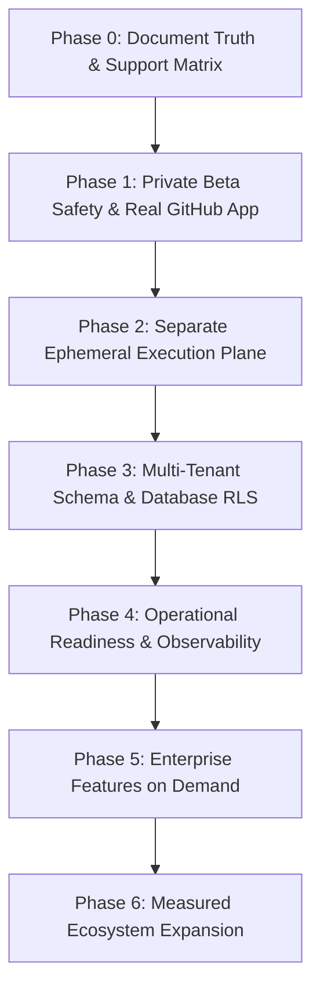

# Patchbay - Enterprise Readiness Specification & Production Roadmap

This document provides a truthful, architecturally sound specification of Patchbay's current local MVP capabilities, security boundaries, database requirements, and phase-by-phase production roadmap. It serves as an authoritative specification for engineering leaders, security auditors, and automated coding agents (e.g. Codex).

---

## 1. Current State & Truthful Reality

Patchbay is currently a **strong local, production-shaped MVP**. The core remediation engine workflow is implemented end-to-end: static impact analysis, AST diff generation, deterministic policy evaluation, approval workflows, local draft PR generation, and append-only audit events.

### Support Matrix

| Vendor / Integration                                                     | Monitored | Analyzed | Plan-Only  | Auto-Remediated (Patch + Validate) | Default Policy Gate                                    |
| :----------------------------------------------------------------------- | :-------: | :------: | :--------: | :--------------------------------: | :----------------------------------------------------- |
| **OpenAI Node SDK** (`createChatCompletion` → `chat.completions.create`) |    ✅     |    ✅    |     ❌     |             **✅ Yes**             | Auto Draft PR (if confidence ≥ 85 & validation passes) |
| **Stripe Node SDK** (customer creation `metadata`)                       |    ✅     |    ✅    |     ❌     |             **✅ Yes**             | Requires Human Approval (`PAYMENT` risk tag)           |
| **Auth0 SDK** (`jwtCheck` middleware update)                             |    ✅     |    ✅    |     ❌     |             **✅ Yes**             | Requires Mandatory Human Approval (`AUTH` risk tag)    |
| **Twilio SDK** (`messages.create` deprecation)                           |    ✅     |    ✅    |     ❌     |             **✅ Yes**             | Auto Draft PR (if confidence ≥ 85 & validation passes) |
| **Generic OpenAPI Diff** (schema property/endpoint changes)              |    ✅     |    ✅    | **✅ Yes** |               ❌ No                | Plan-Only Strategy (No automated patch generation)     |

### Single Launch Target Workflow

- **Launch Scope**: OpenAI Node SDK migrations (`openai@3.x` to `openai@4.x`) for GitHub TypeScript/Node.js repositories using `pnpm` or `npm`.

---

## 2. Technical Audit & Architecture Gaps

A rigorous architectural review reveals the following key gaps between the local MVP and an enterprise production platform:

### 1. Execution Plane Isolation (High Risk)

- **Current State**: The sandbox runner ([`packages/sandbox-runner/src/index.ts`](file:///C:/Users/SHAIK%20MOHAMMAD%20REHAN/patchbay/packages/sandbox-runner/src/index.ts)) executes allowlisted commands (`pnpm install --frozen-lockfile`) via `child_process.spawn` directly on the host node by default.
- **Implemented**: `SANDBOX_RUNTIME=container` — ephemeral Docker containers with `--network none`, `--cap-drop ALL`, `--security-opt no-new-privileges`, read-only rootfs (workspace is the only writable path), CPU/memory/PID caps, static minimal environment (never the worker's secrets), hard timeouts via SIGKILL; covered by live Docker integration tests (run, timeout, egress block, redaction, env isolation).
- **Security Risk**: A malicious or compromised repository `package.json` with `preinstall` or `postinstall` lifecycle hooks can execute arbitrary shell code during `pnpm install` — on the host with the default process backend (dev-only), and inside an isolated container with the container backend.
- **Fix Required**: Make the container backend the default and move execution to a physically separated, ephemeral execution plane (microVMs with firewall-enforced egress limits) for multi-tenant production.

### 2. Mock Git Provider & Real GitHub App

- **Current State**: `LocalGitProvider` ([`packages/git-provider/src/index.ts`](file:///C:/Users/SHAIK%20MOHAMMAD%20REHAN/patchbay/packages/git-provider/src/index.ts)) makes a local temp folder copy and returns `file:///...` URLs; it remains the offline default.
- **Implemented**: `GitHubAppProvider` with RS256 App JWT signing (`createAppJwt`, node:crypto), installation access tokens, HMAC SHA-256 webhook verification (`x-hub-signature-256`), delivery dedup by `x-github-delivery`, and draft PR creation over the GitHub REST API. Installations are org-bound only through the authenticated callback (signed state cookie + API validation).
- **Remaining**: token rotation/revocation UI, check runs, review comments, commit signing, and a hardened execution plane before auto-merge.

### 3. Multi-Tenant Database Schema Prerequisites (RLS)

- **Current State**: Direct `organizationId` columns with indexes now exist on all operational tables (Repository, RepositoryScan, IntegrationUsage, ImpactAssessment, ImpactAssessmentUsage, RemediationPlan, PatchArtifact, ValidationRun, PullRequest, Policy, Approval, GitHubInstallation, VendorChangeEvent; WebhookDelivery carries an optional org) via migration `20260809091648_tenant_scoping_github_app`.
- **Database Flaw**: Row-Level Security (RLS) policies are still **not enabled** — the schema prerequisite is in place, but RLS enforcement plus transaction-scoped `app.current_organization_id` remains production work.

### 4. Logger Architecture

- **Current State**: The logger ([`packages/domain/src/logger.ts`](file:///C:/Users/SHAIK%20MOHAMMAD%20REHAN/patchbay/packages/domain/src/logger.ts)) is a lightweight custom JSON console logger with correlation ID support. It is **not** Pino and currently lacks log shipping, external metric collection, or distributed tracing.

### 5. PR Creation Idempotency

- **Current State**: Unique constraint `remediationPlanId` on `PullRequest` plus worker-level idempotency (returns the existing PR on retry) ensure exactly-once PR creation.

### 6. AI Strategy Safety

- **Current State**: `packages/ai-provider` is intentionally stubbed.
- **AI Policy**: AI output **must remain plan-only and advisory**. AI will never automatically apply un-verified code edits or execute commands until a human-reviewed rule promotion workflow exists.

---

## 3. Revised Phased Production Roadmap



### Phase 0: Document Truth & Support Matrix (Current Phase)

- [x] Update `docs/enterprise-readiness.md`, `README.md`, and `docs/implementation-plan.md` to reflect local policy, approvals, and mock PR creation.
- [x] Document accurate support matrix and launch target workflow (OpenAI Node SDK).
- [x] Add PR creation idempotency guards and audit event for `POLICY_BLOCKED`.

### Phase 1: Private Beta Safety (Target: Initial Users)

- [x] Implement production `GitHubProvider` with RS256 App private key signing, installation tokens, and draft PR endpoints (`GitHubAppProvider`, 8 unit tests).
- [x] Implement GitHub webhook listener with HMAC SHA-256 signature verification (`x-hub-signature-256`) and delivery deduplication.
- [x] Add unique constraint `remediationPlanId` on `PullRequest` table in Prisma schema.
- [x] Add structured audit logging for `POLICY_BLOCKED` and `PR_FAILED`.
- [x] Add Playwright / Vitest E2E tests mocking GitHub API responses.
- [ ] Install token rotation/revocation UI; GitHub App check runs + review comments.

### Phase 2: Separate Ephemeral Execution Plane

- [ ] Decouple sandbox runner from web/worker application host into a dedicated Linux runner service.
- [ ] Execute validation commands in ephemeral gVisor / Docker containers with:
  - CPU limit: 1.0 core, Memory limit: 512MB, Process cap: 64.
  - Short-lived GitHub tokens passed only into the runner container.
  - Outbound egress restricted to GitHub API and npm/pnpm registry proxy only.
  - Instant workspace and container destruction after execution.

### Phase 3: Multi-Tenant Database Foundation

- [ ] Database Migration: Add explicit `organizationId` column to `RemediationPlan`, `ValidationRun`, `PullRequest`, `PatchArtifact`, and `Approval`.
- [ ] Implement transaction-scoped PostgreSQL Row-Level Security (RLS):
  ```sql
  ALTER TABLE "RemediationPlan" ENABLE ROW LEVEL SECURITY;
  CREATE POLICY plan_tenant_isolation ON "RemediationPlan"
    USING ("organizationId" = current_setting('app.current_organization_id'));
  ```
- [ ] Implement cloud KMS envelope encryption for stored repository tokens and secrets.

### Phase 4: Operational Readiness

- [ ] Add OpenTelemetry (OTel) instrumentation for HTTP routes and background jobs.
- [ ] Configure BullMQ Dead Letter Queues (DLQ) with alert hooks.
- [ ] Implement downloadable audit event evidence export (`GET /api/audit/export`).

### Phase 5: Enterprise Features on Demand

- [ ] Add OIDC SSO (Google Workspace, Okta) based on customer requirements.
- [ ] Add SAML 2.0, SCIM directory provisioning, and SIEM audit exports as enterprise custom add-ons.

### Phase 6: Measured Ecosystem Expansion

- [ ] Expand rule engine fixtures for additional SDKs (Stripe v2, Twilio v2).
- [ ] Expand polyglot AST parsers (Python `libcst`, Go `go/ast`) after TypeScript/GitHub has paying design partners.
- [ ] Keep LLM outputs strictly plan-only until promoted to signed deterministic rules.
